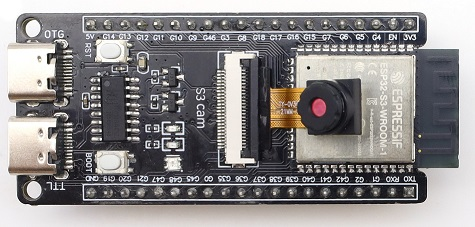
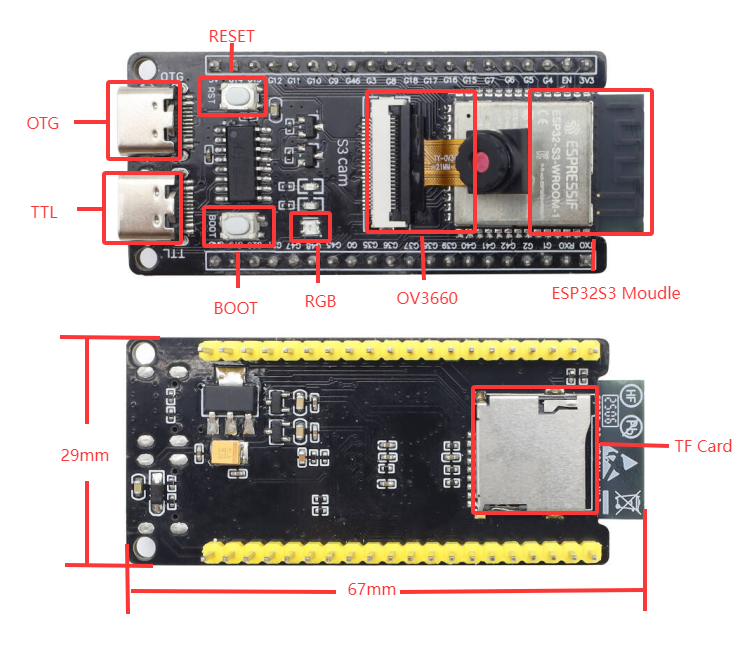
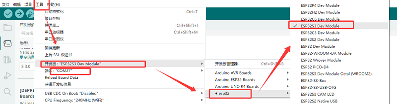
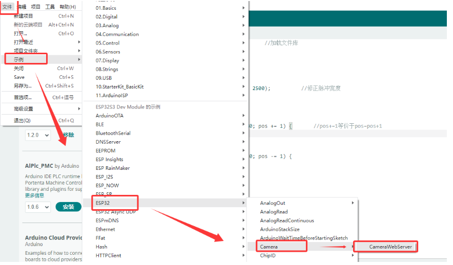
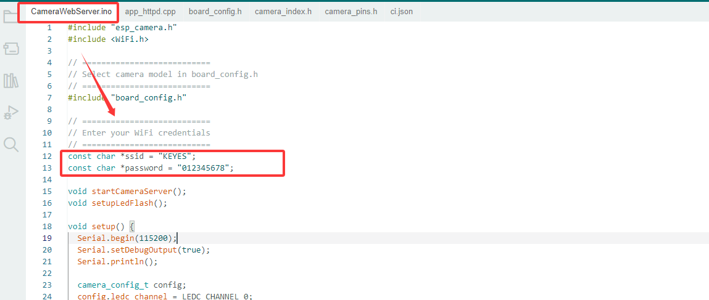
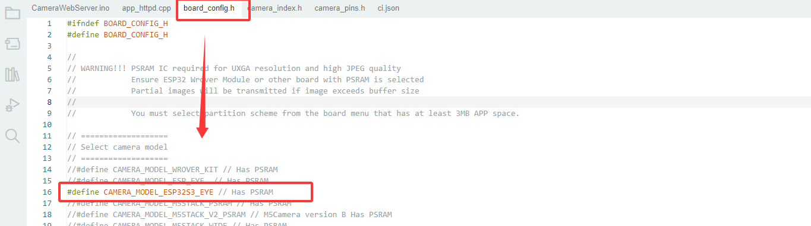
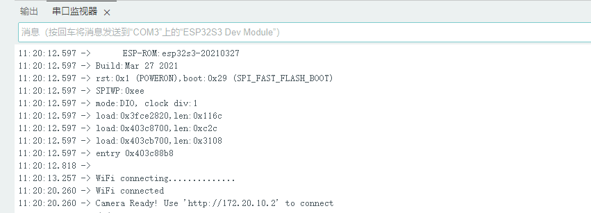
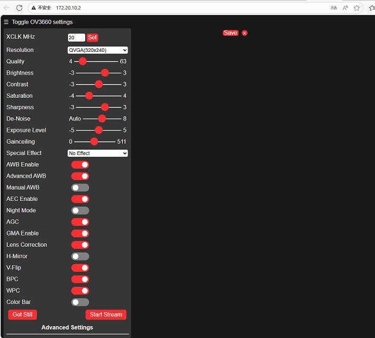
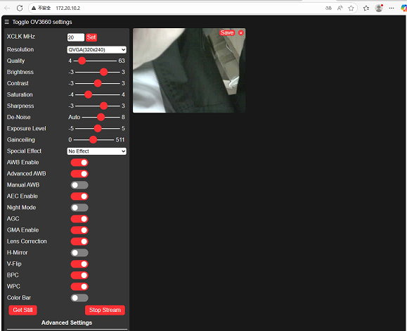
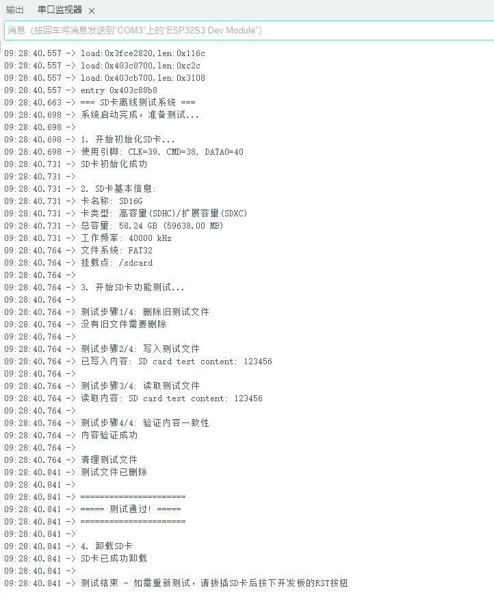

# MB0184 S3 cam



## 1. 介绍

S3 mini开发板是一款基于乐鑫ESP32 S3 WROOM-1-N16R8模组，其双核 Xtensa LX7 MCU 主频达 240MHz，内置 16MB FLASH、8MB SRAM 等存储，集成 2.4GHz Wi-Fi 与低功耗蓝牙(Bluetooth® LE)。它板载Type-C转串口，Type-C 转OTG，RGB LED，并且将GPIO口通过排针引出，两排排针的间距为25.5mm，方便开发者快速开发与实验。可应用于智能家居、工业自动化、医疗保健、消费电子、智慧农场等。

## 2. 规格参数

- 工作电压：DC3.3V
- 输入电压：DC3.3~DC5V 
- 工作电流：120mA(平均)
- ESP32模组：ESP32-S3-WROOM-1
- ​FLASH：16MB
- ​时钟频率：240MHZ
- 摄像头类型：OV3660
- SD卡：采用SD_MMC一线模式
- USB转串口：采用Type C 接口，CH340C USB转串口芯片（可通过此接口下载程序）
- USB转OTG：采用Type-C接口，此接口可用于debug调试或外部挂载存储设备
- 产品尺寸：67*29mm

## 3. 接口描述



具体引脚功能可以参考[用户手册](https://www.espressif.com.cn/sites/default/files/documentation/esp32-s3_datasheet_cn.pdf)
开发板部分引脚与外设连接示意表
| 开发板 | 摄像头 | SD卡 |
| :-- | :-- | :-- |
| IO4 | SIOD |  |
| IO5 | SIOC |  |
| IO6 | VYSNC |  |
| IO7 | HREF | |
| IO15 | XCLK |  |
| IO16 | Y9 | |
| IO17 | Y8 |  |
| IO18 | Y7 |  |
| IO12 | Y6 | |
| IO10 | Y5 |  |
| IO8 | Y4 |  |
| IO9 | Y3 |  |
| IO11 | Y2 |  |
| IO13 | PCLK |  |
| IO38 |  | CMD |
| IO39 |  | CLK |
| IO40 |  | DATA |
## 4. Arduino

Arduino IDE安装请参考: [Arduino IDE](https://www.keyesrobot.cn/projects/Arduino)

请仔细阅读以上参考链接。
### 下载
在上述Arduino IDE 安装教程中有如何安装ESP32芯片包的说明(安装的版本可以为最新版)，此处就不过多赘述。
首先我们打开下载好的Arduino IDE 软件，点击工具->开发板->esp32->ESP32S3 DEV Moudle;端口选择使用USB线与开发板后新增的端口（如未有新增串口请检查是否[安装CH340驱动](https://www.keyesrobot.cn/projects/Arduino)或更换USB线）。

### OV3660示例
随后点击“文件->示例->ESP32->Camera->CameraWebServer”,打开用户示例。

在**CameraWebServer.ino**中修改开发板需要连接的WiFi密码和账户名，"*ssid"为账户名，"*password"为WiFi密码。
**注意：后续打开摄像头观察实验现象电脑也需连接该WiFi.**(开发板于电脑处于同一局域网即可)

在**board.config.h**中修改开发板类型为"CAMERA_MODEL_ESP32S3_EYE".

随后单进行程序下载即可。
下载成功后串口会打印以下信息

在浏览器输入打印出来的链接"http://172.20.10.2"(具体链接以打印的为准)


进来之后首先会没有画面,我们需要点击“Start Stream”,便会出现画面如下图。

### SD卡示例
首先，还是开发板连接好电脑，选择好对应的开发板和端口

然后复制好下列代码，直接烧录到开发板即可。
```
#include "driver/sdmmc_host.h"
#include "driver/sdmmc_defs.h"
#include "esp_vfs_fat.h"
#include "sdmmc_cmd.h"
#include <stdio.h>
#include <string.h>
#include <unistd.h>

// SDIO引脚定义 - 使用ESP32-S3的SDIO引脚
#define SD_CLK_PIN GPIO_NUM_39  // SD卡时钟
#define SD_CMD_PIN GPIO_NUM_38  // SD卡命令
#define SD_D0_PIN  GPIO_NUM_40  // SD卡数据线0

// 全局变量
bool sdCardAvailable = false;
sdmmc_card_t* sdCard = nullptr; 

// 函数声明
bool initSDCard();
bool testSDCard();
void printSDCardInfo();
void printTestResult(bool result);
void unmountSDCard();
void runTestCycle();

void setup() {
  // 初始化串口
  Serial.begin(115200);
  
  // 等待串口准备就绪
  while (!Serial) {
    usleep(100000); // 等待0.1秒
  }
  
  Serial.println("=== SD卡离线测试系统 ===");
  Serial.println("系统启动完成，准备测试...\n");
  
  // 运行初始测试
  runTestCycle();
  
  // 提示用户可以重新测试
  Serial.println("\n测试结束 - 如需重新测试，请拔插SD卡后按下开发板的RST按钮");
}

void loop() {
  // 主循环保持空闲，不做任何操作
  delay(1000);
}

// 完整测试流程
void runTestCycle() {
  // 初始化SD卡
  Serial.println("1. 开始初始化SD卡...");
  sdCardAvailable = initSDCard();
  
  if (sdCardAvailable) {
    // 打印SD卡基本信息
    Serial.println("\n2. SD卡基本信息:");
    printSDCardInfo();
    
    // 执行SD卡测试
    Serial.println("\n3. 开始SD卡功能测试...");
    bool testResult = testSDCard();
    
    // 打印测试结果
    printTestResult(testResult);
    
    // 卸载SD卡（释放资源）
    Serial.println("\n4. 卸载SD卡");
    unmountSDCard();
  } else {
    Serial.println("\n初始化失败，无法进行测试");
  }
}

// 初始化SD卡 - 使用SDMMC模式
bool initSDCard() {
  Serial.printf("使用引脚: CLK=%d, CMD=%d, DATA0=%d\n", 
                SD_CLK_PIN, SD_CMD_PIN, SD_D0_PIN);

  // 配置SDMMC主机
  sdmmc_host_t host = SDMMC_HOST_DEFAULT();
  host.max_freq_khz = SDMMC_FREQ_HIGHSPEED;
  
  // 配置SDMMC插槽
  sdmmc_slot_config_t slot_config = SDMMC_SLOT_CONFIG_DEFAULT();
  slot_config.clk = (gpio_num_t)SD_CLK_PIN;
  slot_config.cmd = (gpio_num_t)SD_CMD_PIN;
  slot_config.d0 = (gpio_num_t)SD_D0_PIN;
  slot_config.width = 1;  // 1位模式
  
  // 挂载配置
  esp_vfs_fat_sdmmc_mount_config_t mount_config = {
    .format_if_mount_failed = false,
    .max_files = 5,
    .allocation_unit_size = 16 * 1024
  };
  
  esp_err_t ret = esp_vfs_fat_sdmmc_mount("/sdcard", &host, &slot_config, &mount_config, &sdCard);
  
  if (ret != ESP_OK) {
    Serial.printf("SDMMC挂载失败: 0x%x - %s\n", ret, esp_err_to_name(ret));
    
    // 尝试格式化
    Serial.println("尝试格式化SD卡...");
    mount_config.format_if_mount_failed = true;
    ret = esp_vfs_fat_sdmmc_mount("/sdcard", &host, &slot_config, &mount_config, &sdCard);
    
    if (ret != ESP_OK) {
      Serial.printf("格式化也失败: 0x%x - %s\n", ret, esp_err_to_name(ret));
      return false;
    }
  }
  
  Serial.println("SD卡初始化成功");
  return true;
}

// SD卡测试函数
bool testSDCard() {
  if (!sdCardAvailable) return false;
  
  String testPath = "/sdcard/test.txt";
  bool testPassed = true;
  
  // 1. 删除可能存在的旧测试文件
  Serial.println("\n测试步骤1/4: 删除旧测试文件");
  if (remove(testPath.c_str()) != 0) {
    if (errno != ENOENT) {  // ENOENT表示文件不存在，属于正常情况
      Serial.printf("删除失败: %s\n", strerror(errno));
      testPassed = false;
    } else {
      Serial.println("没有旧文件需要删除");
    }
  } else {
    Serial.println("旧文件删除成功");
  }
  
  // 2. 写入测试文件
  Serial.println("\n测试步骤2/4: 写入测试文件");
  FILE* file = fopen(testPath.c_str(), "w");
  if (!file) {
    Serial.println("写入失败: 无法创建文件");
    return false;
  }
  
  const char* testContent = "SD card test content: 123456";
  fprintf(file, "%s", testContent);
  fclose(file);
  Serial.printf("已写入内容: %s\n", testContent);
  
  // 3. 读取测试文件
  Serial.println("\n测试步骤3/4: 读取测试文件");
  file = fopen(testPath.c_str(), "r");
  if (!file) {
    Serial.println("读取失败: 无法打开文件");
    return false;
  }
  
  char content[100] = {0};
  fread(content, 1, sizeof(content)-1, file);
  fclose(file);
  
  // 移除可能的换行符
  String contentStr = String(content);
  contentStr.trim();
  Serial.printf("读取内容: %s\n", contentStr.c_str());
  
  // 4. 验证内容
  Serial.println("\n测试步骤4/4: 验证内容一致性");
  if (contentStr != testContent) {
    Serial.println("内容验证失败: 期望与实际不符");
    testPassed = false;
  } else {
    Serial.println("内容验证成功");
  }
  
  // 清理测试文件
  Serial.println("\n清理测试文件");
  if (remove(testPath.c_str()) != 0) {
    Serial.printf("测试文件删除失败: %s\n", strerror(errno));
    // 删除失败不视为测试失败
  } else {
    Serial.println("测试文件已删除");
  }
  
  return testPassed;
}

// 打印SD卡信息
void printSDCardInfo() {
  if (!sdCardAvailable) return;
  
  // 卡名称
  Serial.printf("卡名称: %s\n", sdCard->cid.name);
  
  // 卡类型
  Serial.print("卡类型: ");
  if (sdCard->ocr & 0x40000000) {
    Serial.println("高容量(SDHC)/扩展容量(SDXC)");
  } else {
    Serial.println("标准容量(SDSC)");
  }
  
  // 容量信息
  uint64_t cardSize = (uint64_t)sdCard->csd.capacity * sdCard->csd.sector_size;
  Serial.printf("总容量: %.2f GB (%.2f MB)\n", 
                (float)cardSize / (1024 * 1024 * 1024),
                (float)cardSize / (1024 * 1024));
  
  // 工作频率
  Serial.printf("工作频率: %d kHz\n", sdCard->max_freq_khz);
  
  // 文件系统
  Serial.println("文件系统: FAT32");
  Serial.println("挂载点: /sdcard");
}

// 打印测试结果
void printTestResult(bool result) {
  Serial.println("\n======================");
  if (result) {
    Serial.println("===== 测试通过! =====");
  } else {
    Serial.println("===== 测试失败! =====");
  }
  Serial.println("======================");
}

// 卸载SD卡
void unmountSDCard() {
  if (sdCardAvailable) {
    esp_vfs_fat_sdmmc_unmount();
    sdCardAvailable = false;
    Serial.println("SD卡已成功卸载");
  }
}
```
烧录成功后串口会打印以下测试信息


如果没有打印以上信息，请更换容量小于64GB的SD卡或将SD卡格式化为FTA32格式。
## 5. 注意事项

1.无法烧录程序到开发板？

答：请更换数据线或重新安装CH340驱动。

2.请勿直接使用IO口直接接入大功率电机。
